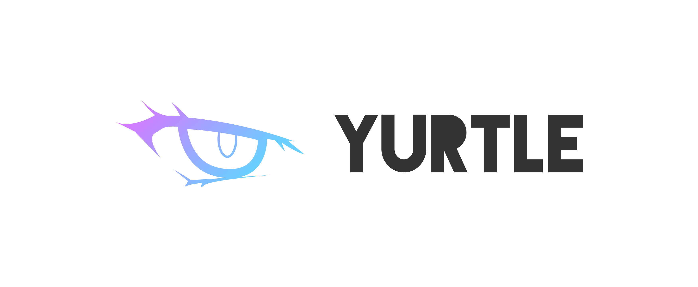
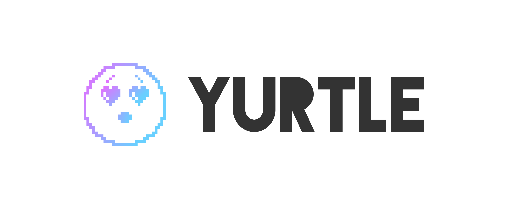
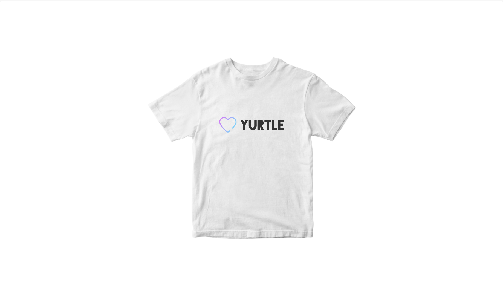
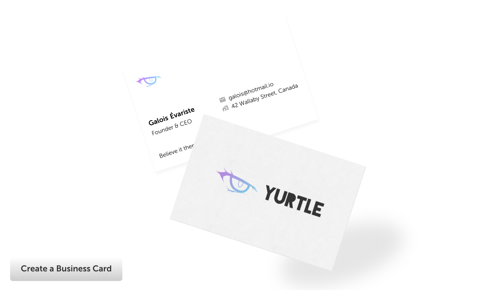
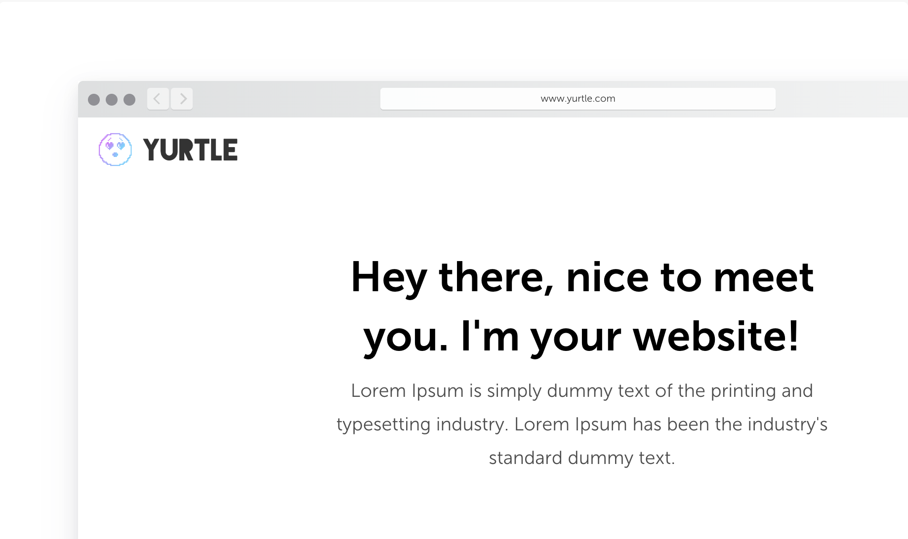
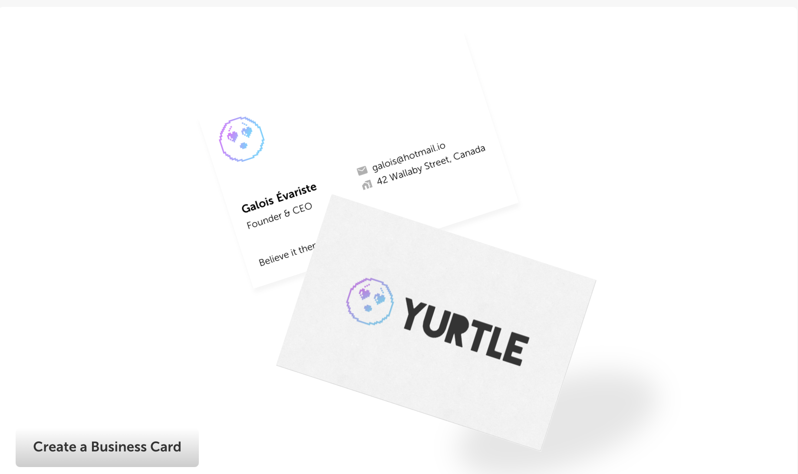

<header style="align-items: center;">
  <h1 style="text-align: center">
    Yurtle
    Anime Logo Designs
  </h1>
</header>

<main>

   <h3 style="text-align: center;">Default Logo - text only</h3>
    
  

  

    

        
      

      

        
      

      

        
      

  

  

  <h3 style="text-align: center;">Option 1: Heart Icon + Logo Text
  </h3>
  

  
  
  
  

 

  <h3 style="text-align: center;">Option 2: Eye Icon + Logo Text
  </h3>
  

  
  
  
  

 

  <h3 style="text-align: center;">Option 3: Emoji Icon + Logo Text
  </h3>
  

  
  
  
  

 
</main>
